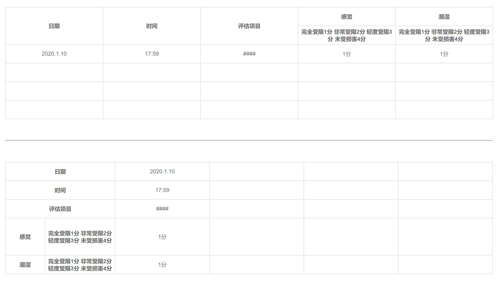

# create-table-simple

json数据创建表格




### 下载该组件 
```javascript

npm install create-table-simple

```

### 组件的使用

在main.js里引用该组件
```javascript

import CreateTable from "create-table-simple";

Vue.use(CreateTable);

``` 
使用组件
```html
<template>
  <div id="app">
    <!-- 横向 -->
    <RowTable :rowData="colData" :tableValue="tableValue"></RowTable>
    <br>
    <br>
    <hr />
    <br>
    <br>
    <!-- 竖向 -->
    <ColTable :colData="colData" :tableValue="tableValue"></ColTable>
  </div>
</template>

<!-- 数据格式 -->
data() {
    return {
      colData: [
          {
            id: '1',
            name: '日期'
          },
          {
            id: '2',
            name: '时间'
          },
          {
            id: '3',
            name: '评估项目'
          },
          {
            id: '4',
            name: '感觉',
            children: [
                {
                    id: '5',
                    height: '80px',
                    width: '150px',
                    name: '完全受限1分 非常受限2分 轻度受限3分 未受损害4分'
                }
            ]
          },
          {
            id: '6',
            name: '潮湿',
            children: [
                {
                    id: '7',
                    name: '完全受限1分 非常受限2分 轻度受限3分 未受损害4分'
                }
            ]
          }
        ],
        tableValue: [
            {
              '1': '2020.1.10',
              '2': '17:59',
              '3': '####',
              '5': '1分',
              '7': '1分'
            },
            {},
            {},
            {}
        ]
    }
  }
```


